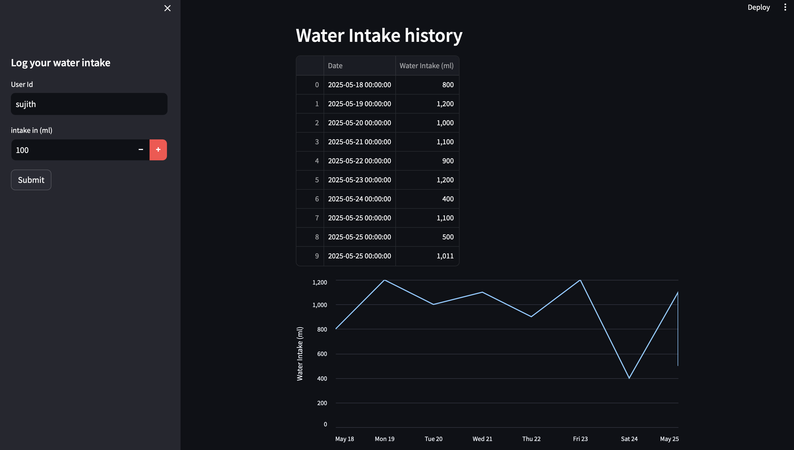

# 💧 AI Water Intake Tracker

An intelligent hydration tracking app powered by **LangChain** and **Gemini Flash** (Google Generative AI). This app lets users log daily water intake, receive AI-powered feedback, and visualize their hydration history—all through a clean and interactive Streamlit dashboard.

---

## 🚀 Features

- ✅ Log daily water intake by user ID
- 🧠 AI feedback on whether you're drinking enough water
- 📈 Visual history of your water intake using line plots
- 🗃️ Data is stored persistently in a local SQLite database
- 🌐 Built with **Streamlit** for a seamless web interface
- 🔗 Powered by **Gemini Flash LLM** via LangChain

---

## 📸 UI Preview

Here’s a look at the AI-powered water tracker dashboard:



> _Tip: Replace the path with the actual location where you place the screenshot in your repo._

---

## 🛠️ Tech Stack

- **Python 3.11**
- **Streamlit**
- **LangChain**
- **Google Generative AI (Gemini Flash)**
- **SQLite**
- **Pandas**

---

## 📂 Project Structure

```plaintext
├── dashboard.py               # Main Streamlit app
├── src/
│   ├── agent.py               # LangChain-based AI agent
│   └── database.py            # SQLite DB interactions
├── myenv/                     # Python virtual environment (not tracked)
├── assets/
│   └── water-tracker-demo.png # Screenshot of the app
├── requirements.txt           # Required packages
└── README.md                  # You are here!
